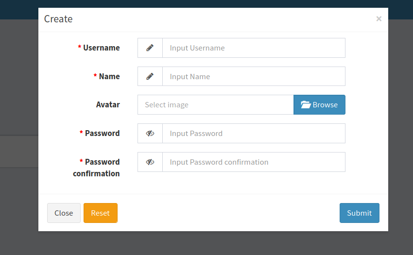

Modal Form / laravel-admin-extensions
======

## Requires
- "php": ">=7.2.0",
- "encore/laravel-admin": "~1.6"

## Installation
### Publishing
Execute command below to publish package. 
It will copy vendor resources to your application public directory.
~~~
php artisan vendor:publish --provider="Encore\ModalForm\ModalFormServiceProvider"
~~~
### Update
To update assets of package add ```--force``` option to publishing command.
## Documentation
### 1. Create modal button
Use Encore\ModalForm\Form\ModalButton class to create modal button. In constructor pass parameters (string $title, string $href)
```php
use Encore\Admin\Layout\Content;
use Encore\Admin\Layout\Column;
use Encore\Admin\Layout\Row;
use Encore\Admin\Widgets\Box;
use Encore\ModalForm\Form\ModalButton;

class HomeController {
    ...
    public function index(Content $content)
    {
        return $content->row(function (Row $row){
                   $row->column(4, function (Column $column){
                       $box = new Box();

                        //creates modal button with `Modal` title and generated route
                       $modalButton = new ModalButton('Modal', route('modal-form.create'));
                       
                       $box->content($modalButton);
                       $column->append($box);
                   });
               });
    }
}
```
#### Methods
```php
//overrides classes of html button tag
$modalButton->setClass('btn-primary');

//appends class to existing once
$modalButton->addClass('btn-primary');

//retrieving settled classes as string
$modalButton->getClasses();

//sets href
$modalButton->setHref('url');

//returns settled hrefg
$modalButton->getHref();
```
### 2. Form
Use modal form as regular Admin form
```php
use \Encore\ModalForm\Form\ModalForm;

new ModalForm(new Administrator(), function (ModalForm $form){
    $form->display('id', 'ID');
    
    //set action for proper submitting
    $form->setAction(route('modal-index-route'));
});
```

Or by Modal facade like Admin facade
```php
use \Encore\ModalForm\Facades\Modal;

Modal::form(new Administrator(), function (ModalForm $form){
    ...
});
```

Modal size can be changed:
```php
$form->small();

$form->medium();

$form->large();
```

### 3. JS
Events are triggered on modal button. 

Button selector: 
```js
$('a[data-form="modal"]');
```
####Events:
##### 1. ```modelCreating```
After modal form submit
##### 2. ```modelFailed```
On ajax response error
##### 3. ```modelValidationFailed```
On response validation error
##### 4. ```modelCreated```
On model creation success. While this events is triggered, model id can be found in button data. Id can be found there until new model is created
```js
$('a[data-form="modal"]').on('modelCreated', (e) => {
    var createdModelId = $(e.target).data('model-id');
});
``` 
